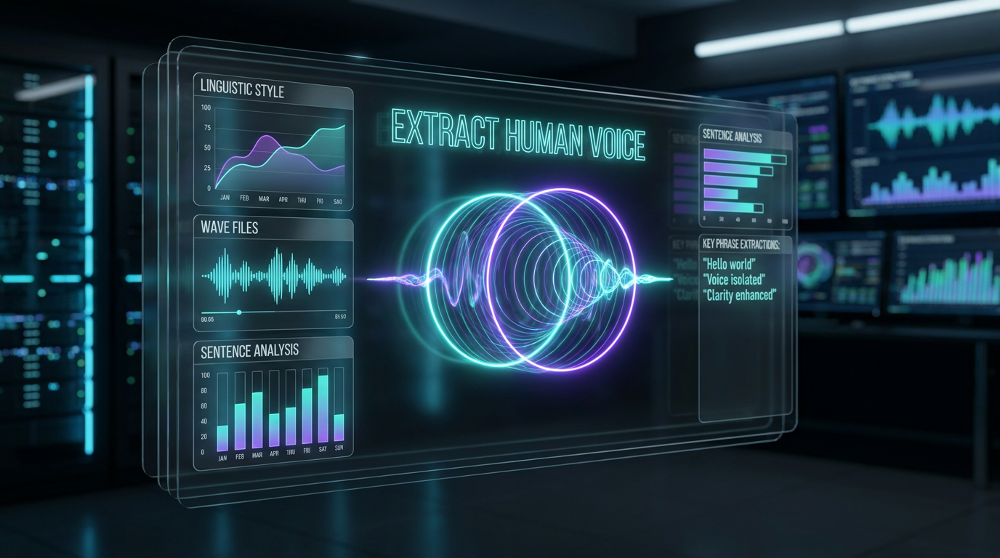

> [!IMPORTANT]
> **DISCLAIMER & LIABILITY NOTICE**: This is a **personal, individual project** created and maintained entirely by the author (Prashanth). It is **not** an official Google product, it is **not** affiliated with or supported by Google Cloud or Google LLC, and it does **not** come with any official support or warranty. By using this software, you acknowledge that you are solely liable for its use.

# 🎙️ Extract Human Voice

[](https://skills.sh)



An advanced, high-fidelity custom skill and script pipeline engineered to automatically extract, parse, and structure a developer's unique voice and writing tone from major AI coding systems (Antigravity, Gemini CLI, Claude Code, Cline, Roo Code, Aider, and Cursor).

This skill scans local conversation databases and logs, programmatically scrubs PII and hardcoded credentials, and structures your unique conversational styles, linguistic heuristics, and engineering preferences into canonical, copybara-compatible markdown profiles.

---

## 🔄 Voice Extraction & Persona Synthesis Pipeline

The skill executes a structured extraction flow to translate raw SQLite log records into highly-refined, PII-free style guidelines:

```mermaid
flowchart TD
    Scan[1. Scan Local Logs & DBs<br>Antigravity, Gemini, Claude, Cursor, Aider] --> Scrub[2. scrub_pii() Filters<br>Keys, Secrets, Emails, Domains]
    Scrub --> Analyze[3. Analyze Linguistic Style<br>Lexicons, Structural Heuristics, Sentence Lengths]
    Analyze --> Package[4. Package Canonical Outputs<br>voice_and_tone.md Golden Rules]
    Package --> Template[5. Synthesize custom SKILL.md<br>Copybara Writing Assistant Profiles]
    
    classDef steps fill:#0e101f,stroke:#00b0ff,stroke-width:2px,color:#fff;
    class Scan,Scrub,Analyze,Package,Template steps;
```

---

## 📂 Repository Structure

The package contents are fully organized for installation via `npx skills`:

| Path | Type | Purpose |
| :--- | :--- | :--- |
| `skills/extract-human-voice/SKILL.md` | Core Instructions | Standard skill metadata, instruction patterns, and SQLite discovery schemas. |
| `skills/extract-human-voice/scripts/extract_voice.py` | Python Engine | Core extraction script parsing raw databases, scrubbing secrets, and compiling metrics. |
| `skills/extract-human-voice/REFERENCE.md` | Reference Guide | Full structural layouts and sqlite schemas for major client directories (Claude, Cursor, etc.). |
| `skills/extract-human-voice/EXAMPLES.md` | Examples | Complete before-and-after samples demonstrating PII scrubbing precision. |

---

## 🛠️ Installation & Usage

Install this skill into your agent environment using `npx skills`:

```bash
npx skills add ksprashu/skills-extract-human-voice
```

### Execution Example

To extract your workspace persona and generate structured style assets, execute the Python engine inside your local repository:

```bash
python3 skills/extract-human-voice/scripts/extract_voice.py
```

The script will scan client directories, apply regex scrubs, and export three canonical assets under `output/`:
1. `voice_and_tone.md` (Your core style guidelines, sentence structures, and linguistic heuristics)
2. `golden_examples.md` (Sample high-bar engineering instructions collected from your history)
3. `SKILL.md` (A ready-to-deploy writing assistant skill matching your exact style)
